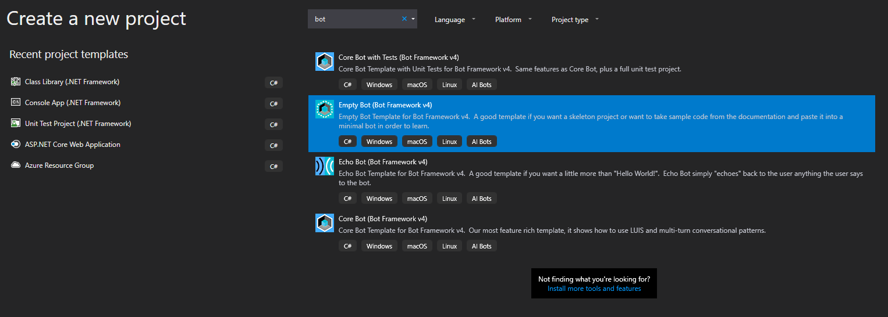
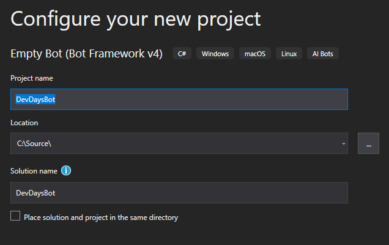
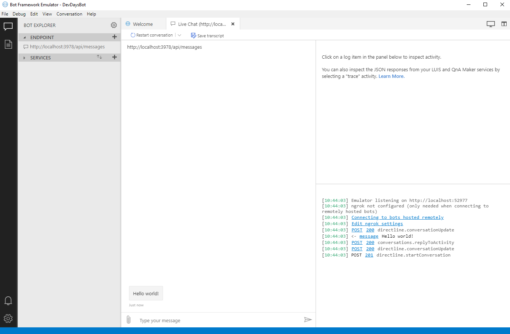
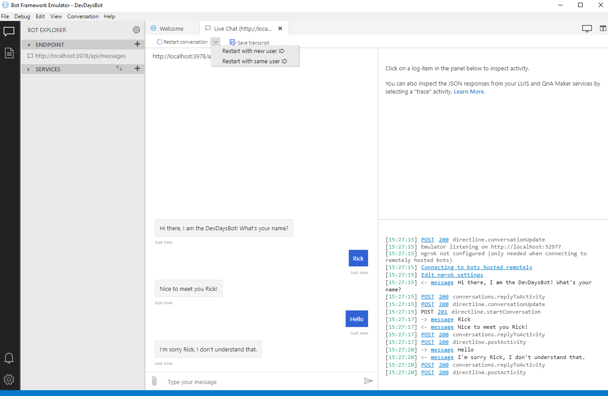
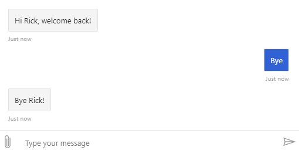

# Lab 01 - Creating a bot

_Workshop at ilionx's DevDays_

In this lab you'll get to know the Microsoft Bot Framework by creating a chat bot which can recognize a returning user, and can perform a few simple actions.

The finished solutions [can be found here](../Resources/FinishedSolutions/Lab01) and are available for you to compare your work, or to take a look when you're having difficulties executing the assignments.

> [Full list of versions used in the workshop](../Resources/VersionsUsed.md)

## **Prerequisites**

-   Visual Studio 2017 or newer
-   [The Microsoft Bot Framework SDK v4 template](https://marketplace.visualstudio.com/items?itemName=BotBuilder.botbuilderv4) is installed
-   [The Microsoft Bot Framework Emulator](https://github.com/Microsoft/BotFramework-Emulator/releases/tag/v4.5.2) is installed

---

## Assignment 1

**1.1 New project)**

-   Create a new project in Visual Studio, select the `Empty Bot` template. Enter `DevDaysBot` as the project name. You can choose any other name you like here, but the workshop will follow said name.



-   The template we use to create the project does not generate the name entered. Therefore, when the project has been created, navigate to the following two files and change the following:

    -   In `DevDaysBot.cs` change the class name to `DevDaysBot`
    -   In `Startup.cs`, replace line 36 with `services.AddTransient<IBot, DevDaysBot>();`
        <br/>

-   Start the project and verify that it runs correctly, you should see this in your browser:


<br/>

**1.2 Setting up the Emulator)**

Now that the project in running we can use the Bot Framework Emulator to test our bot, here we will set this up.

-   In the browser window that popped up, notice the url under the _'Your bot is ready!'_ text. Copy this url.
-   Open the Bot Framework Emulator, select `Create a new bot configuration`.
    -   For the name, enter `DevDaysBot`.
    -   For the Endpoint URL, enter the url you copied.
    -   The rest can be kept as it is.
-   Click `Save and connect`, save the .bot file in the project you created.
-   You are now able to communicate with the bot and see the _'Hello world!'_ message. The bot doesn't do much at this moment though, lets change that.


<br/>

---

## Assignment 2

Our bot can't do much yet, lets add some functionality. In this assignment we will add the following:

-   When meeting a new user, ask their name.
-   Recognize a returning user and refer to them by name.
-   The ability to respond to:
    -   a greeting
    -   a goodbye

**2.1 Setting up state)**

-   Currently we are receiving a _'Hello world!'_ message when entering a conversation with the bot. Here we want to ask for the name of the user. In `DevDaysBot.cs` change the text in the `SendActivityAsync` function to something like: `Hi there, I am the DevDaysBot! What's your name?`.

Ok, so the user is now prompted to enter their name, but how do we store the response? For this we will use the [state](https://docs.microsoft.com/en-us/azure/bot-service/bot-builder-concept-state?view=azure-bot-service-4.0).

> In this workshop we will use _memory storage_ to store the state, in real world projects you want to use a different type of storage. The reason for this is that the memory storage is cleared each restart. It is built for testing purposes.

-   Create a new folder in the project called `Models`. Create two files in this folder:

    -   `UserProfile.cs`
        -   Add a string property called `Name` with a default getter and setter.
    -   `ConversationData.cs`
        -   Add a bool property called `PromptedForName` with a default getter and setter.

    <br/>

-   In `Startup.cs` add the code below in the `ConfigureServices` function.
    ```C#
    services.AddSingleton<IStorage, MemoryStorage>();
    services.AddSingleton<UserState>();
    services.AddSingleton<ConversationState>();
    ```
-   In `DevDaysBot.cs` implement the constructor and define two private properties:

    ```C#
    private BotState _conversationState;
    private BotState _userState;

    public DevDaysBot(ConversationState conversationState, UserState userState)
    {
        _conversationState = conversationState;
        _userState = userState;
    }
    ```

-   Add the OnTurnAsync function to save changes that might have occured.

    ```C#
    public override async Task OnTurnAsync(ITurnContext turnContext, CancellationToken cancellationToken = default)
        {
            await base.OnTurnAsync(turnContext, cancellationToken);

            // Save any state changes that might have occured during the turn.
            await _conversationState.SaveChangesAsync(turnContext, false, cancellationToken);
            await _userState.SaveChangesAsync(turnContext, false, cancellationToken);
        }
    ```

    <br/>

**2.2 Meeting a new user)**

Alright, so we set up the state, now it's time to interact with it and store the name of the user.

In the `OnMembersAddedAsync` function we ask the user for their name, because of this we have to set our `PromptedForName` property in our `conversationState`. To do this we need to access the state, for this we have [accessors](https://docs.microsoft.com/en-us/azure/bot-service/bot-builder-howto-v4-state?view=azure-bot-service-4.0&tabs=csharp#add-state-property-accessors).

-   at the top of the `OnMembersAddedAsync` function, implement the code below. This allows us to interact with the `conversationData`.

    ```C#
    var conversationStateAccessors = _conversationState.CreateProperty<ConversationData>(nameof(ConversationData));
    var conversationData = await conversationStateAccessors.GetAsync(turnContext, () => new ConversationData());
    ```

-   Set the `PromptedForName` property to `true` after you ask the user for their name in the `OnMembersAddedAsync` function.

<br/>

The next step is to handle the response of the user. In this case this means storing the response as the name. When the user sends a message the function `OnMessageActivityAsync` is triggered, in this function we will create our logic.

-   Add the following function to the `DevDaysBot` class in `DevDaysBot.cs`.

    ```C#
    protected override async Task OnMessageActivityAsync(ITurnContext<IMessageActivity> turnContext, CancellationToken cancellationToken)
        {
            // Extract the conversationData from the state accessors
            var conversationStateAccessors = _conversationState.CreateProperty<ConversationData>(nameof(ConversationData));
            var conversationData = await conversationStateAccessors.GetAsync(turnContext, () => new ConversationData());

            // Extract the userProfile from the state accessors
            var userStateAccessors = _userState.CreateProperty<UserProfile>(nameof(UserProfile));
            var userProfile = await userStateAccessors.GetAsync(turnContext, () => new UserProfile());
        }
    ```

<br/>
In this function we want to check whether the name of the user is already known, and if the user has been prompted for it.

<br/>

-   Add the following code at the bottom of the `OnMessageActivityAsync` function. This code will store the name after the bot has asked for the name of the user.

    ```C#
    if (string.IsNullOrEmpty(userProfile.Name) && conversationData.PromptedForName)
        {
            userProfile.Name = turnContext.Activity.Text?.Trim();
            conversationData.PromptedForName = false;

            // Acknowledge that we got their name.
            await turnContext.SendActivityAsync($"Nice to meet you {userProfile.Name}!");

            // End the turn here.
            return;
        }
    ```

    <br/>

**2.3 Recognize a returning user)**

-   After the if-statement in the `OnMessageActivityAsync` in function in `DevDaysBot.cs`, add a switch-statement for the value of `turnContext.Activity.Text.ToLower()`. In the default of this switch-statement, use `await turnContext.SendActivityAsync()` to send a message from the bot which says something like `I'm sorry {userProfile.Name}, I don't understand that.` For now this default statement is the only statement in the switch.

    <br/>

-   In the Bot Emulator, select `Restart with same user ID` to simulate a new conversation with the same user. Notice how the the bot starts the conversation by asking our name. Since our name is already known, we don't want that, we want the bot to welcome us back. Lets add that.

> **How to restart with the same user ID.**
> Select the dropdown next to `Restart conversation` to see the option to restart with the same user ID.
>
>  <br/>

-   Replace the implementation of the `OnMembersAddedAsync` function in `DevDaysBot.cs` with the following:

    ```C#
    // Extract the conversationData from the state accessors
    var conversationStateAccessors = _conversationState.CreateProperty<ConversationData>(nameof(ConversationData));
    var conversationData = await conversationStateAccessors.GetAsync(turnContext, () => new ConversationData());

    // Extract the userProfile from the state accessors
    var userStateAccessors = _userState.CreateProperty<UserProfile>(nameof(UserProfile));
    var userProfile = await userStateAccessors.GetAsync(turnContext, () => new UserProfile());

    foreach (var member in membersAdded)
    {
        if (member.Id != turnContext.Activity.Recipient.Id)
        {
            if (string.IsNullOrEmpty(userProfile.Name))
            {
                await turnContext.SendActivityAsync(MessageFactory.Text($"Hi there, I am the DevDaysBot! What's your name?"), cancellationToken);
                conversationData.PromptedForName = true;
            }
            else
            {
                await turnContext.SendActivityAsync(MessageFactory.Text($"Hi {userProfile.Name}, welcome back!"), cancellationToken);
            }
        }
    }
    ```

<br>

Now our bot will ask for our name if this is not yet known, otherwise it will greet the returning user. Nice work!

<br/>

**2.4 Add responses)**

-   In the switch-statement in the `OnMessageActivityAsync` function, add two cases:
    -   A case for `hello`, greet the user by sending a message here
    -   A case for `bye`, say goodbye to the user by sending a message here

The bot will now understand these 'commands' and will know how to act on them. Later on we will add more complex commands.



---

### Wrap up

In this lab you created a chat bot which can recognize a returning user and handle a few simple commands. Nice job!

In the [next lab](./Lab02.md) we will integrate [LUIS](https://azure.microsoft.com/nl-nl/services/cognitive-services/language-understanding-intelligent-service/) with our bot.

<br>

[Back to the overview](../README.md)

---

### Already done?

You're fast! If you want you can take a look at [dialogs within the Bot Framework](https://docs.microsoft.com/en-us/azure/bot-service/bot-builder-concept-dialog?view=azure-bot-service-4.0) and [how to implement them](https://docs.microsoft.com/en-us/azure/bot-service/bot-builder-dialog-manage-conversation-flow?view=azure-bot-service-4.0&tabs=csharp). Try to implement it in your project.

Dialogs are a central concept within the Bot Framework, using dialogs is a way to manage the conversations your bot has with its users, and keep it more organized. Read more about dialogs by following the links above!
