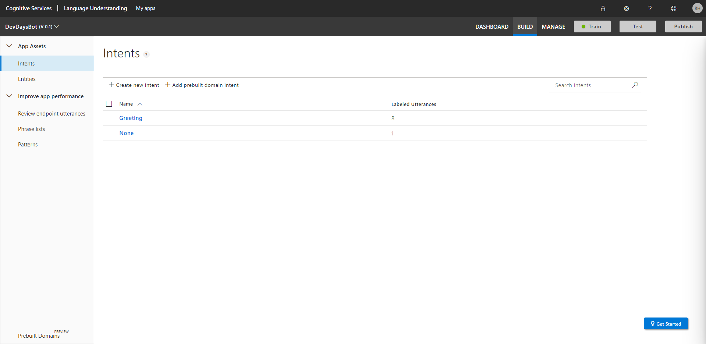

# Lab 02 - Implementing LUIS

_Workshop at ilionx's DevDays_

In this lab you'll get to work with LUIS to implement language understanding for your bot.

The finished solutions [can be found here](../Resources/FinishedSolutions/Lab02) and are available for you to compare your work, or to take a look when you're having difficulties executing the assignments.

> [Full list of versions used in the workshop](../Resources/VersionsUsed.md)

## **Prerequisites**

-   Visual Studio 2017 or newer
-   [The Microsoft Bot Framework SDK v4 template](https://marketplace.visualstudio.com/items?itemName=BotBuilder.botbuilderv4) is installed
-   [The Microsoft Bot Framework Emulator](https://github.com/Microsoft/BotFramework-Emulator/releases/tag/v4.5.2) is installed
-   A finished solution of the previous lab. If you didn't complete the first lab yet you can get a finished solution [here](../Resources/FinishedSolutions/Lab01).

---

## Assignment 1

**1.1 Creating the LUIS application)**

-   Navigate to [LUIS portal](https://eu.luis.ai)
-   Click on `Create new app`
    -   Choose any name you like, in this workshop we'll use `DevDaysBot`
    -   Select the culture (languague) you want to use, in this workshop we'll use english

> Starting on 6/8/2020 LUIS will require an Azure resource. During this workshop we will not create this to reduce complexity. [Learn more](https://docs.microsoft.com/en-us/azure/cognitive-services/luis/luis-migration-authoring).
>
> 

<br>

**1.2 Adding intents)**

-   Navigate to the `Build` tab, here you can see the list of intents.



-   Create a new intent with the name `Greeting`
-   Enter a few different utterances for this intent, using these differenct utterances we can train our LUIS application.


-   In the `None` intent, add a couple of random utterances that don't have to do anything with our bot. What you enter here can be anything, be sure however to not make these utterances too similar to any other intents.
-   Add a `Help` intent, we will use this to enable the bot to explain what its purpose is. Example utterances are:
    -   _Who are you?_
    -   _What can you do?_
    -   _Help_
    -   _Huh?_
    -   _I don't understand_

<br>

**1.3 Training and publishing)**

Now that we have some intents set up we can train our LUIS application to try to assign incoming utterances to its known intents. When this finished, you can test the model by pressing `Test`.

-   Click `Train` to train your LUIS model
-   Publish your LUIS model by pressing `Publish`, select production.

-   Navigate to the `Manage` tab, under `Azure Resources`, copy the following values:
    -   Primary key (in blue)
    -   AppID (in orange)


<br>

---

## Assignment 2

**1.1 Creating Middleware)**

In this assignment we will use the LUIS application we created from within our bot. This will allow it to better understand the user's intentions, therefore improving the user experience. We want to know what the user means with the message they send before we continue with our logic. To achieve this we will create custom [middleware](https://docs.microsoft.com/en-us/azure/bot-service/bot-builder-concept-middleware?view=azure-bot-service-4.0).

First of all, we'll need to install a NuGet package which will allow us to easily access our LUIS application.

-   Install the `Microsoft.Bot.Builder.AI.Luis` NuGet package to your solution.

<br>

-   Navigate to `appsettings.json` in your solution in Visual Studio
-   Add the following in this file:
    -   `LuisAppId` with its corresponding value
    -   `LuisAPIKey` with its corresponding value
    -   `LuisAPIHostName` with the value of `https://westeurope.api.cognitive.microsoft.com`

> Note: We created our LUIS application through the european portal [(eu.luis.ai)](eu.luis.ai), if you created it in a different region, the value of the hostname will be different.

<br>

-   Create a new folder called `Middleware`. In this folder, create a new class file called `IntentRecognizerMiddleware.cs`. This class should implement the `IMiddleware` interface.

-   Add a private readonly LuisRecognizer property and a constructor. The values we use to create the LuisApplication are retrieved from the `appsettings.json`.

    ```C#
        private readonly LuisRecognizer luisRecognizer;

        public IntentRecognizerMiddleware(IConfiguration configuration)
        {
            var luisApplication = new LuisApplication(
                configuration["LuisAppId"],
                configuration["LuisAPIKey"],
                configuration["LuisAPIHostName"]);

            luisRecognizer = new LuisRecognizer(luisApplication);
        }
    ```

-   Next, lets implement the `OnTurnAsync` function. This will use the LuisRecognizer to access our LUIS application and pass the message of the user. Using the response we retrieve the highest scoring intent and add it to the `TurnState`. This will allow us to retrieve this value in our `DevDaysBot.cs` file.

    ```C#
    public async Task OnTurnAsync(ITurnContext turnContext, NextDelegate next, CancellationToken cancellationToken = default)
        {
            if (!string.IsNullOrEmpty(turnContext.Activity.Text))
            {
                var recognizerResult = await luisRecognizer.RecognizeAsync(turnContext, cancellationToken);
                var (intent, score) = recognizerResult.GetTopScoringIntent();

            turnContext.TurnState.Add("Intent", intent);
            }
            await next(cancellationToken);
        }
    ```

<br>

We've created our custom middleware, nice work! Lets now start using it.
