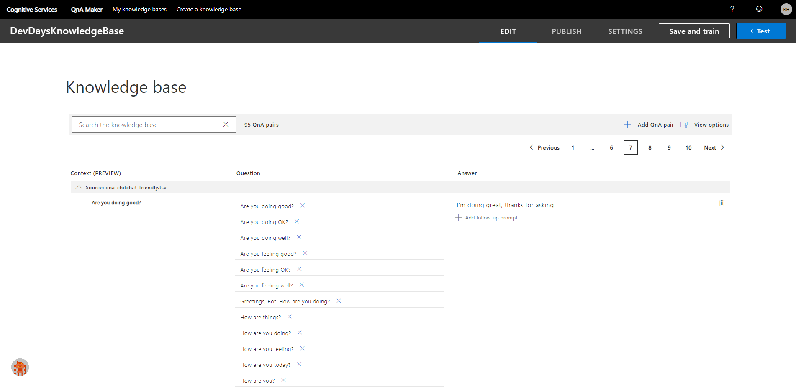

# Lab 03 - QnA maker and Dispatch tool

_Workshop at ilionx's DevDays_

In this lab you'll ...

The finished solutions [can be found here](../Resources/FinishedSolutions/Lab03) and are available for you to compare your work, or to take a look when you're having difficulties executing the assignments.

> [Full list of versions used in the workshop](../Resources/VersionsUsed.md)

## **Prerequisites**

-   Visual Studio 2017 or newer
-   [The Microsoft Bot Framework SDK v4 template](https://marketplace.visualstudio.com/items?itemName=BotBuilder.botbuilderv4) is installed
-   [The Microsoft Bot Framework Emulator](https://github.com/Microsoft/BotFramework-Emulator/releases/tag/v4.5.2) is installed
-   A finished solution of the previous lab. If you didn't complete the first lab yet you can get a finished solution [here](../Resources/FinishedSolutions/Lab01).
-   NPM is installed

---

## Assignment 1

In this assignment we will add another cognitive service to our bot; [QnA Maker](https://www.qnamaker.ai/). This service will handle simple questions or statements which don't need underlying logic. This means questions like _'How are you?'_.

But how will our bot know which of these services to approach? When should it go to LUIS, and when should it go to the QnA Maker? For this we will use the [dispatch tool](https://docs.microsoft.com/en-us/azure/bot-service/bot-builder-tutorial-dispatch?view=azure-bot-service-4.0&tabs=cs#create-the-dispatch-model).



**1.1 Dispatch tool)**

-   Create a new folder in the solution called `CognitiveModels`.
-   Open a new terminal and navigate to the newly created folder
-   run `npm i -g botdispatch`
-   run the following command. For the filename you can enter 'dispatcher'. The luisAuthroingKey is located under 'Azure Resources' in the LUIS portal under the label 'primary key'.
    ```
    dispatch init -n <filename-to-create> --luisAuthoringKey "<your-luis-key>" --luisAuthoringRegion westeurope
    ```
    > If you created the LUIS application in a different region be sure to enter that region instead of 'westeurope'.
-   run:
    ```
    dispatch add -t luis -i "<luis-app-id>" -n "<luis-app-name>" -v <lui-app-version-number> -k "<your-luis-key>" --intentName l_DevDaysLuisApplication
    ```
-   Open [this file](https://ilionx.sharepoint.com/:w:/s/BotsforHealthcare/Eb22nrweHzlHn5vUqdPqofwB6t0hA6bLLVmo7KLNuc0YMw?e=trH90s) to view the command for adding the existing QnA application. Run this command. You'll need to have access to the ilionx sharepoint for this.
    <br>

-   run `dispatch create`
-   When the script finished running, copy the `appId` value as shown in the terminal near the bottom. Replace the `LuisAppId` value in `appsettings.json` with the copied value.

**1.2 BotServices - Setup)**

To keep our services organized, we will create a seperate file where we define the services that we use.

-   Create a `BotServices.cs` class file with the following implementation:

    ```C#
    using Microsoft.Bot.Builder.AI.Luis;
    using Microsoft.Bot.Builder.AI.QnA;
    using Microsoft.Extensions.Configuration;

    namespace DevDaysBot
    {
        public class BotServices
        {
            public LuisRecognizer Dispatch { get; private set; }
            public QnAMaker DevDaysQnA { get; private set; }

            public BotServices(IConfiguration configuration)
            {
                Dispatch = new LuisRecognizer(new LuisApplication(
                    configuration["LuisAppId"],
                    configuration["LuisAPIKey"],
                    configuration["LuisAPIHostName"]),
                    new LuisPredictionOptions { IncludeAllIntents = true, IncludeInstanceData = true },
                    includeApiResults: true);

                DevDaysQnA = new QnAMaker(new QnAMakerEndpoint
                {
                    KnowledgeBaseId = configuration["QnAKnowledgebaseId"],
                    EndpointKey = configuration["QnAEndpointKey"],
                    Host = configuration["QnAEndpointHostName"]
                });
            }

        }
    }
    ```

-   Open [this file](https://ilionx.sharepoint.com/:w:/s/BotsforHealthcare/Eb22nrweHzlHn5vUqdPqofwB6t0hA6bLLVmo7KLNuc0YMw?e=trH90s) again. Copy the key/value pairs for `appsettings.json` and add them to your `appsettings.json` file.

-   In `Startup.cs`, add the following line to the `ConfigureServices` function:

    ```C#
    // Create the bot services (LUIS, QnA) as a singleton.
    services.AddSingleton<BotServices>();
    ```

-   In `AdapterWithErrorHandler.cs` change the constructor from:

    ```C#
    public AdapterWithErrorHandler(IConfiguration configuration, ILogger<BotFrameworkHttpAdapter> logger)
        : base(configuration, logger)
    {
    ```

    to:

    ```C#
    public AdapterWithErrorHandler(IConfiguration configuration, ILogger<BotFrameworkHttpAdapter> logger, BotServices botServices)
        : base(configuration, logger)
    {
    ```

-   In the same file, change `Use(new IntentRecognizerMiddleware(configuration));` to `Use(new IntentRecognizerMiddleware(botServices));`

<br>

-   Change the contents of `IntentRecognizerMiddleware.cs` to:

    ```C#
    using System.Threading;
    using System.Threading.Tasks;
    using Microsoft.Bot.Builder;
    using Microsoft.Bot.Builder.AI.Luis;

    namespace DevDaysBot.Middleware
    {
        public class IntentRecognizerMiddleware : IMiddleware
        {
            private readonly LuisRecognizer dispatch;

            public IntentRecognizerMiddleware(BotServices botServices)
            {
                this.dispatch = botServices.Dispatch;
            }

            public async Task OnTurnAsync(ITurnContext turnContext, NextDelegate next, CancellationToken cancellationToken = default)
            {
                if (!string.IsNullOrEmpty(turnContext.Activity.Text))
                {
                    var recognizerResult = await dispatch.RecognizeAsync(turnContext, cancellationToken);
                    var (intent, score) = recognizerResult.GetTopScoringIntent();

                    turnContext.TurnState.Add("Intent", intent);
                    turnContext.TurnState.Add("recognizerResult", recognizerResult);
                }
                await next(cancellationToken);
            }
        }
    }
    ```

<br>

**1.3 BotServices - Logic)**

-   In `DevDaysBot.cs` add the following property to the class.
    ```C#
    private BotServices _botServices;
    ```
-   Change the constructor to look like this:

    ```C#
    public DevDaysBot(ConversationState conversationState, UserState userState, BotServices botServices)
      {
          _botServices = botServices;
          _conversationState = conversationState;
          _userState = userState;
      }
    ```

-   Add two functions to the same file:

    -   ProcessLuisResult

        ```C#
        private async Task ProcessLuisResult(ITurnContext<IMessageActivity> turnContext, LuisResult luisResult, CancellationToken cancellationToken, UserProfile userProfile)
        {
            // Retrieve LUIS results.
            var result = luisResult.ConnectedServiceResult;
            var topIntent = result.TopScoringIntent.Intent;

            switch (topIntent)
            {
                case "GetLeaveBalance":
                    Random random = new Random();
                    // In a real application we would want to fetch the remaining leave hours from an actual source.
                    // For the purpose of this workshop a random number is generated.
                    await turnContext.SendActivityAsync($"You have {random.Next(1, 200)} hours left to use this year.");
                    break;
                case "CallInSickToday":
                    // For the purpose of this workshop we only send a confirmation message.
                    await turnContext.SendActivityAsync($"Alright, I've notified your manager, get better soon!");
                    break;
                default:
                    await turnContext.SendActivityAsync($"I'm sorry {userProfile.Name}, I don't understand that.");
                    break;
            }
        }
        ```

    -   ProcessQnA
        ```C#
        private async Task ProcessQnA(ITurnContext<IMessageActivity> turnContext, CancellationToken cancellationToken)
        {
            var results = await _botServices.DevDaysQnA.GetAnswersAsync(turnContext);
            if (results.Any())
            {
                await turnContext.SendActivityAsync(MessageFactory.Text(results.First().Answer), cancellationToken);
            }
            else
            {
                await turnContext.SendActivityAsync(MessageFactory.Text("Sorry, could not find an answer in the Q and A system."), cancellationToken);
            }
        }
        ```

<br>

The casual chit-chat like a greeting, a goodbye, et cetera, will now be handled by the QnA Maker service.

-   Change the switch-statement and the retrieval of information from the TurnContext in `OnMessageActivityAsync` to look like this:

    ```C#
    // Retrieve the intent and recognizerResult from the TurnContext, this was added to the TurnContext in the IntentRecognizerMiddleware.
    string intent = turnContext.TurnState.Get<string>("Intent");
    RecognizerResult recognizerResult = turnContext.TurnState.Get<RecognizerResult>("recognizerResult");

    // Execute the desired logic based on the retrieved intent.
    switch (intent)
    {
        case "l_DevDaysLuisApplication":
            await ProcessLuisResult(turnContext, recognizerResult.Properties["luisResult"] as LuisResult, cancellationToken, userProfile);
            break;
        case "q_DevDaysQnA":
            await ProcessQnA(turnContext, cancellationToken);
            break;
        default:
            await turnContext.SendActivityAsync($"I'm sorry {userProfile.Name}, I don't understand that.");
            break;
    }
    ```

---

### Wrap up

In this lab you integrated two different cognitive services - LUIS and QnA Maker - with your bot, including a dispatcher which helps your bot determine which of these services to approach.

Nice job!

You can check your solution with the [finished solution](../Resources/FinishedSolutions/Lab03).

<br>

[Back to the overview](../README.md)
